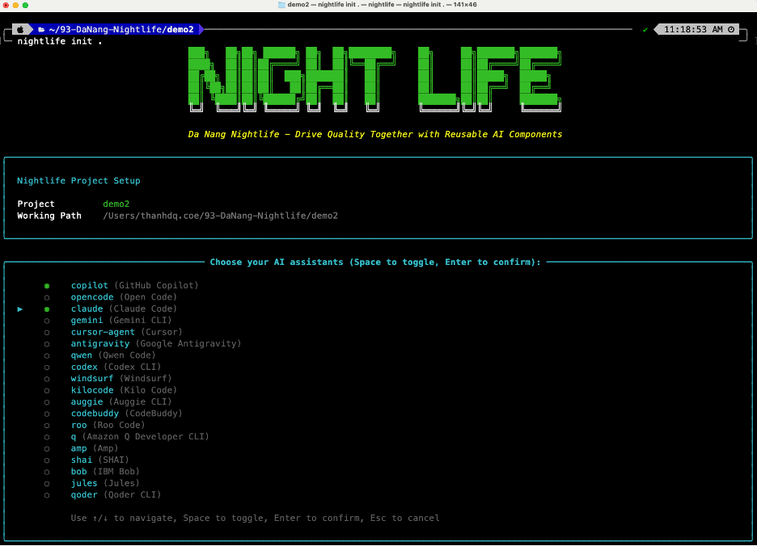
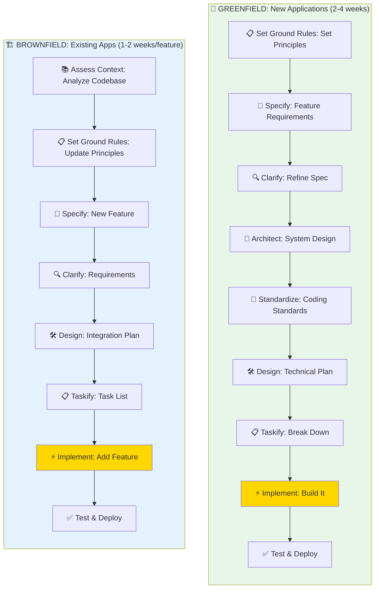
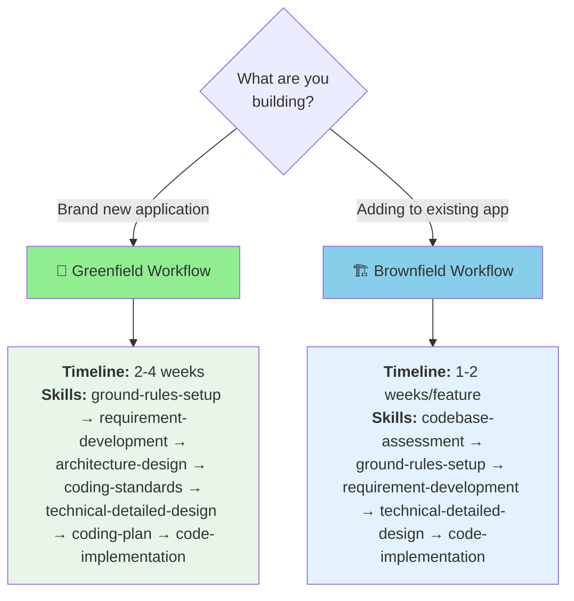

<div align="center">

# 🌌 Danang Nightlife

## *Drive Quality Together with AI-Powered Framework*

**Stop guessing. Start specifying.**  
Turn your ideas into production-ready applications through clear specifications, not trial-and-error coding.

[](https://github.com/dauquangthanh/danang-nightlife/actions/workflows/release.yml)
[](https://github.com/dauquangthanh/danang-nightlife/stargazers)
[](https://github.com/dauquangthanh/danang-nightlife/blob/main/LICENSE)
[](https://dauquangthanh.github.io/danang-nightlife/)

</div>

---

## Table of Contents

- [🤔 What is Spec-Driven Development?](#-what-is-spec-driven-development)
- [⚡ Get Started](#quick-start)
- [🤖 Supported AI Agents](#-supported-ai-agents)
- [🔧 Nightlife CLI Reference](#-nightlife-cli-reference)
- [📚 Core Philosophy](#spec-driven-development-sdd)
- [🌟 Development Phases](#-development-phases)
- [🔧 Prerequisites](#-prerequisites)
- [📖 Learn More](#-learn-more)
- [📋 Detailed Process](#-detailed-process)
- [🔍 Troubleshooting](#-troubleshooting)
- [👥 Maintainers](#-maintainers)
- [💬 Support](#-support)
- [🙏 Acknowledgements](#-acknowledgements)
- [📄 License](#-license)

## 💡 What is Spec-Driven Development?

**Traditional approach:** Write code first, figure it out as you go.  
**Spec-Driven approach:** Define what you want first, then let AI build it right.

For decades, we treated specifications as throwaway notes—just a formality before the "real" coding began. Spec-Driven Development flips this around: **your specification becomes the blueprint** that directly generates working code, not just a suggestion.

> **Think of it like architecture:** You wouldn't build a house without blueprints. Why build software without clear specifications?

### Development Approaches

Danang Nightlife supports both **Greenfield** (new projects) and **Brownfield** (existing projects) development:

```mermaid
flowchart LR
    Start([Project Type?])
    Start --> Greenfield[🌱 Greenfield<br/>New Project]
    Start --> Brownfield[🏗️ Brownfield<br/>Existing Project]
    
    Greenfield --> GF1[📋 Set Ground Rules<br/>Set Principles]
    GF1 --> GF2[🎯 Specify<br/>Define Features]
    GF2 --> GF3[🔍 Clarify<br/>Refine Requirements]
    GF3 --> GF4[📝 Architect<br/>System Design]
    GF4 --> GF5[📏 Standardize<br/>Coding Rules]
    GF5 --> GF6[🛠️ Design<br/>Technical Plan]
    GF6 --> GF7[📋 Taskify<br/>Break Down Tasks]
    GF7 --> GF8[⚡ Implement<br/>Build Features]
    GF8 --> GF9[✅ Test & Deploy]
    
    Brownfield --> BF1[📚 Assess Context<br/>Analyze Codebase]
    BF1 --> BF2[📋 Set Ground Rules<br/>Update Principles]
    BF2 --> BF3[🎯 Specify<br/>New Feature]
    BF3 --> BF4[🔍 Clarify<br/>Requirements]
    BF4 --> BF5[🛠️ Design<br/>Integration Plan]
    BF5 --> BF6[📋 Taskify<br/>Task Breakdown]
    BF6 --> BF7[⚡ Implement<br/>Add Feature]
    BF7 --> BF8[✅ Test & Deploy]
    
    style Greenfield fill:#90EE90
    style Brownfield fill:#87CEEB
    style GF8 fill:#FFD700
    style BF7 fill:#FFD700
```



**Greenfield** projects start with establishing principles, architecture, and standards before building features. **Brownfield** projects begin with `gen-codebase-assessment` to understand existing architecture and patterns, then follow a streamlined workflow to add new features while maintaining consistency.

**Key Differences:**

| Aspect | 🌱 Greenfield | 🏗️ Brownfield |
|--------|--------------|---------------|
| **Starting Point** | Empty project | Existing codebase |
| **Setup Phase** | `gen-project-ground-rules-setup` | `gen-codebase-assessment` (once per project) |
| **Focus** | Establish foundations first | Integrate with existing patterns |
| **Timeline** | 2-4 weeks (MVP) | 1-2 weeks per feature |
| **Flexibility** | Complete freedom in design | Must maintain consistency |
| **Skills Used** | Full workflow (9 core + 2 product-level) | Streamlined (7 core skills) |

### Install Nightlife CLI

**Recommended: Install once, use everywhere**

```bash
uv tool install nightlife-cli --from git+https://github.com/dauquangthanh/danang-nightlife.git
```

Then use it anywhere:

```bash
nightlife init <PROJECT_NAME>
nightlife check
```

<p align="center">
  
</p>

**Need to upgrade?** See the [Upgrade Guide](./docs/upgrade.md) or run (replaces agent command folders with timestamped backups):

```bash
uv tool install nightlife-cli --force --from git+https://github.com/dauquangthanh/danang-nightlife.git
```

```bash
uv tool install nightlife-cli --force --native-tls --from git+https://github.com/dauquangthanh/danang-nightlife.git
```

<details>
<summary><strong>Alternative: Run without installing</strong></summary>

```bash
uvx --from git+https://github.com/dauquangthanh/danang-nightlife.git nightlife init <PROJECT_NAME>
```

```bash
uvx --native-tls --from git+https://github.com/dauquangthanh/danang-nightlife.git nightlife init <PROJECT_NAME>
```

**Why install?**

- ✅ Available everywhere in your terminal
- ✅ Easy to upgrade with `uv tool upgrade`
- ✅ Cleaner than shell aliases
- ✅ Better tool management

</details>

---

### Your First Project in 9 Steps

> **💡 How skills work:** Nightlife installs agent skills into your project. Tell your AI assistant what you want to do and it will automatically pick the right skill. You can also reference a skill by name explicitly.

#### 1️⃣ **Set Project Rules**

Launch your AI assistant in the project and tell it to set up ground rules:

> *"Use the `gen-project-ground-rules-setup` skill. Create principles for code quality, maintainability, testing, user experience, and performance at an MVP level."*

#### 2️⃣ **Write the Specification**

Describe **what** you want to build and **why** (not the tech stack yet):

> *"Use the `gen-requirement-development` skill. Build a photo organizer with albums grouped by date. Users can drag-and-drop albums to reorganize them. Albums show photos in a tile view. No nested albums allowed."*

#### 3️⃣ **Clarify Requirements** *(Recommended)*

Use structured questioning to clarify underspecified areas:

> *"Use the `gen-requirement-clarification` skill. Focus on edge cases, data validation, and user experience details."*

#### 4️⃣ **Design System Architecture** *(Optional, once per product)*

Document your system architecture:

> *"Use the `gen-architecture-design` skill. Create C4 diagrams, document tech stack decisions and architecture patterns."*

#### 5️⃣ **Set Coding Standards** *(Optional, once per product)*

Create coding standards for your team:

> *"Use the `gen-coding-standards` skill. Define naming conventions, file organization, and best practices."*

#### 6️⃣ **Create Detailed Design**

Now specify **how** to build it (tech stack and architecture):

> *"Use the `gen-technical-detailed-design` skill. Use Vite with vanilla HTML, CSS, and JavaScript. Keep libraries minimal. Store metadata in local SQLite. No image uploads."*

#### 7️⃣ **Break Down Tasks**

Generate an actionable task list:

> *"Use the `gen-coding-plan` skill."*

#### 8️⃣ **Validate the Plan** *(Recommended)*

Check consistency and coverage before implementation:

> *"Use the `gen-project-consistency-analysis` skill."*

#### 9️⃣ **Build It**

Execute all tasks automatically:

> *"Use the `gen-code-implementation` skill."*

#### 🧪 **Test & Iterate**

Run your application and fix any issues. Your AI assistant will help debug.

---

## 🤖 Supported AI Agents

| Agent | Key | Support |
| ------- | ----- | --------- |
| [Amp](https://ampcode.com/) | `amp` | ✅ |
| [Augment Code](https://docs.augmentcode.com/cli/overview) | `auggie` | ✅ |
| [Claude Code](https://www.anthropic.com/claude-code) | `claude` | ✅ |
| [Cline](https://github.com/cline/cline) | `cline` | ✅ |
| [CodeBuddy CLI](https://www.codebuddy.ai/cli) | `codebuddy` | ✅ |
| [Codex CLI](https://github.com/openai/codex) | `codex` | ✅ |
| [Cursor](https://cursor.sh/) | `cursor-agent` | ✅ |
| [Forge](https://forge.ai/) | `forge` | ✅ |
| [Gemini CLI](https://github.com/google-gemini/gemini-cli) | `gemini` | ✅ |
| [GitHub Copilot](https://code.visualstudio.com/) | `copilot` | ✅ |
| [GitHub Copilot CLI](https://cli.github.com/) | `copilot-cli` | ✅ |
| [Google Antigravity](https://ai.google.dev/) | `antigravity` | ✅ |
| [IBM Bob](https://www.ibm.com/products/bob) | `bob` | ✅ |
| [Junie](https://www.jetbrains.com/junie/) | `junie` | ✅ |
| [Kilo Code](https://github.com/Kilo-Org/kilocode) | `kilocode` | ✅ |
| [Kiro](https://kiro.dev/) | `kiro` | ✅ |
| [Mistral Vibe](https://mistral.ai/) | `vibe` | ✅ |
| [opencode](https://opencode.ai/) | `opencode` | ✅ |
| [Pi Agent](https://pi.ai/) | `pi` | ✅ |
| [Qoder CLI](https://qoder.ai) | `qoder` | ✅ |
| [Qwen Code](https://github.com/QwenLM/qwen-code) | `qwen` | ✅ |
| [Roo Code](https://roocode.com/) | `roo` | ✅ |
| [Tabnine](https://www.tabnine.com/) | `tabnine` | ✅ |
| [Trae](https://trae.ai/) | `trae` | ✅ |
| [Windsurf](https://windsurf.com/) | `windsurf` | ✅ |

## 🔧 Nightlife CLI Reference

The `nightlife` command supports the following options:

### Commands

| Command     | Description                                                    |
| ------------- | ---------------------------------------------------------------- |
| `init`      | Initialize a new Nightlife project from the latest template      |
| `check`     | Check for installed tools (`git`, `claude`, `gemini`, `code`/`code-insiders`, and all supported agent CLIs) |
| `version`   | Display CLI version, template version, and system information  |

### `nightlife init` Arguments & Options

| Argument/Option        | Type     | Description                                                                  |
| ------------------------ | ---------- |------------------------------------------------------------------------------|
| `<project-name>`       | Argument | Name for your new project directory (optional if using `--here`, or use `.` for current directory) |
| `--ai`                 | Option   | AI assistant(s) to use. Can be a single agent or comma-separated list (e.g., `claude,gemini,copilot`). Valid options: `amp`, `antigravity`, `auggie`, `bob`, `claude`, `cline`, `codebuddy`, `codex`, `copilot`, `copilot-cli`, `cursor-agent`, `forge`, `gemini`, `junie`, `kilocode`, `kiro`, `opencode`, `pi`, `qoder`, `qwen`, `roo`, `tabnine`, `trae`, `vibe`, `windsurf`. If not specified, an interactive multi-select menu will appear |
| `--ignore-agent-tools` | Flag     | Skip checks for AI agent tools like Claude Code                             |
| `--no-git`             | Flag     | Skip git repository initialization                                          |
| `--here`               | Flag     | Initialize project in the current directory instead of creating a new one   |
| `--force`              | Flag     | Force merge/overwrite when initializing in current directory (skip confirmation) |
| `--skip-tls`           | Flag     | Skip SSL/TLS verification (not recommended)                                 |
| `--debug`              | Flag     | Enable detailed debug output for troubleshooting                            |
| `--github-token`       | Option   | GitHub token for API requests (or set GH_TOKEN/GITHUB_TOKEN env variable)  |

### Examples

```bash
# Basic project initialization
nightlife init my-project

# Initialize with specific AI assistant
nightlife init my-project --ai claude

# Initialize with multiple AI assistants (comma-separated)
nightlife init my-project --ai claude,gemini,copilot

# Initialize with Cursor support
nightlife init my-project --ai cursor-agent

# Initialize with multiple agents including Windsurf and Amp
nightlife init my-project --ai windsurf,amp,claude

# Initialize with SHAI support
nightlife init my-project --ai shai

# Initialize with IBM Bob support
nightlife init my-project --ai bob

# Initialize with Python scripts (cross-platform)
nightlife init my-project --ai copilot --script py

# Initialize in current directory
nightlife init . --ai copilot
# or use the --here flag
nightlife init --here --ai copilot

# Force merge into current (non-empty) directory without confirmation
nightlife init . --force --ai copilot
# or
nightlife init --here --force --ai copilot

# Skip git initialization
nightlife init my-project --ai gemini --no-git

# Enable debug output for troubleshooting
nightlife init my-project --ai claude --debug

# Use GitHub token for API requests (helpful for corporate environments)
nightlife init my-project --ai claude --github-token ghp_your_token_here

# Check system requirements
nightlife check

# Display version and system information
nightlife version
```

### Agent Personas

Nightlife includes five specialized subagents that organize skills by role. Each agent has a focused responsibility and a defined workflow for both new work and handling changes. Use them by telling your AI assistant to delegate to the appropriate agent, or invoke them directly by name.

| Agent | Role | Key Skills |
| ------- | ------ | ------------ |
| **Business Analyst** | Requirements gathering, spec writing, and requirements updates | `gen-requirement-development`, `gen-requirement-clarification`, `gen-coding-plan`, `gen-project-consistency-analysis` |
| **System Architect** | System design, C4 diagrams, ADRs, and architecture evolution | `gen-architecture-design`, `gen-technical-detailed-design`, `gen-codebase-assessment`, `gen-coding-standards`, `gen-security-review`, `gen-requirement-clarification`, `gen-project-consistency-analysis` |
| **Project Manager** | Ground rules, task planning, standards, and plan updates | `gen-project-ground-rules-setup`, `gen-coding-plan`, `gen-coding-standards`, `gen-git-command-guidelines`, `gen-requirement-clarification`, `gen-project-consistency-analysis` |
| **Developer** | Full-stack implementation, UI mockups, bug fixing, and code review | `gen-code-implementation`, `gen-nextjs-mockup`, `gen-nuxtjs-mockup`, `gen-code-review`, `gen-security-review`, `gen-codebase-assessment`, `gen-git-commit` |
| **Tester** | Test planning, E2E testing with Playwright, and quality validation | `gen-test-plan`, `gen-code-review`, `gen-security-review`, `gen-project-consistency-analysis` + Playwright MCP |

Each agent includes workflows for both **new work** (creating from scratch) and **change management** (handling requirement additions, modifications, and deletions with impact analysis).

### Available Agent Skills

After running `nightlife init`, your AI coding agent will have access to the following skills. Invoke them by telling your agent what you need — it picks the right skill automatically — or reference the skill by name explicitly.

**Core Workflow:**

| Skill | Description |
| ------- | ------------- |
| `gen-project-ground-rules-setup` | Create or update project governing principles and development guidelines (Greenfield) |
| `gen-codebase-assessment` | Analyze existing codebase to understand architecture and patterns (Brownfield) |
| `gen-requirement-development` | Define what you want to build — requirements and user stories |
| `gen-requirement-clarification` | Clarify underspecified areas through structured questioning |
| `gen-architecture-design` | Create comprehensive system architecture documentation |
| `gen-coding-standards` | Create coding standards and conventions documentation |
| `gen-technical-detailed-design` | Create technical implementation plans with your chosen tech stack |
| `gen-coding-plan` | Generate actionable, dependency-ordered task lists |
| `gen-project-consistency-analysis` | Cross-artifact consistency and coverage analysis |
| `gen-code-implementation` | Execute all tasks to build the feature according to the plan |

**Testing & Quality:**

| Skill | Description |
| ------- | ------------- |
| `gen-test-plan` | Create comprehensive test plans with requirements traceability and Playwright E2E scripts |
| `gen-code-review` | Review code for quality, simplicity, and maintainability |
| `gen-security-review` | Review code for security vulnerabilities (OWASP Top 10) |
| `gen-nextjs-mockup` | Create interactive UI mockups using Next.js and Tailwind CSS |
| `gen-nuxtjs-mockup` | Create interactive UI mockups using Nuxt and Tailwind CSS |
| `gen-git-commit` | Generate well-structured conventional commit messages |
| `gen-git-command-guidelines` | Git workflow best practices, branching strategies, and release management |

**Security & Compliance:**

| Skill | Description |
| ------- | ------------- |
| `sec-compliance-standards` | GDPR, HIPAA, SOC2, and PCI-DSS compliance checks and audit readiness |
| `sec-ip-protection` | Code origin verification, license scanning, and IP contamination prevention |

**Tooling & Meta:**

| Skill | Description |
| ------- | ------------- |
| `gen-agent-skill-creation` | Create and validate new agent skills following the Agent Skills specification |
| `gen-update-agent-file` | Generate and update CLAUDE.md and AGENTS.md based on project state |

### Environment Variables

| Variable         | Description                                                                                    |
| ------------------ | ------------------------------------------------------------------------------------------------ |
| `SPECIFY_FEATURE` | Override feature detection for non-Git repositories. Set to the feature directory name (e.g., `001-photo-albums`) to work on a specific feature when not using Git branches.<br/>**Must be set in the context of the agent you're working with prior to using `/nightlife.design` or follow-up commands. |

## 🎯 Why Spec-Driven Development?

Spec-Driven Development is built on these core principles:

| Principle | What It Means |
| ----------- | --------------- |
| **Intent First** | Define the "*what*" and "*why*" before the "*how*" |
| **Rich Specifications** | Create detailed specs with organizational principles and guardrails |
| **Step-by-Step Refinement** | Improve through multiple steps, not one-shot generation |
| **AI-Powered** | Use advanced AI to interpret specifications and generate implementations |

---

## 🌟 When to Use Spec-Driven Development

Danang Nightlife supports three main development scenarios with different workflows:

### Development Workflows Overview



| Scenario | What You Can Do |
| ---------- | ----------------- |
| **🆕 New Projects (Greenfield)** | <ul><li>Start with high-level requirements</li><li>Establish project principles and architecture</li><li>Generate complete specifications</li><li>Plan implementation steps</li><li>Build production-ready apps with clear standards</li></ul> |
| **🔧 Existing Projects (Brownfield)** | <ul><li>Add new features systematically to existing codebases</li><li>Maintain consistency with existing patterns</li><li>Adapt the SDD process to your current architecture</li><li>Integrate new functionality smoothly</li></ul> |
| **🔬 Exploration** | <ul><li>Try different solutions in parallel</li><li>Test multiple tech stacks</li><li>Experiment with UX patterns</li><li>Rapid prototyping and validation</li></ul> |

---

## ⚙️ What You Need

Before you start, make sure you have:

- **Operating System:** Linux, macOS, or Windows
- **AI Assistant:** Any [supported agent](#-supported-ai-agents) (Claude, Gemini, Copilot, Cursor, etc.)
- **Package Manager:** [uv](https://docs.astral.sh/uv/)
- **Python:** [Version 3.11 or higher](https://www.python.org/downloads/)
- **Version Control:** [Git](https://git-scm.com/downloads)

> Having issues with an agent? [Open an issue](https://github.com/dauquangthanh/danang-nightlife/issues/new) so we can improve it.

## 📚 Learn More

### Choose Your Workflow



**Quick Links:**

- 💬 [Get Support](https://github.com/dauquangthanh/danang-nightlife/issues/new) - Ask questions or report issues
- 📄 [View License](./LICENSE) - MIT License
- 🌟 [Star on GitHub](https://github.com/dauquangthanh/danang-nightlife) - Support the project

---

## 📋 Detailed Process

<details>
<summary>Click to expand the detailed step-by-step walkthrough</summary>

### Project Setup

Bootstrap your project with the Nightlife CLI:

```bash
nightlife init <project_name> --ai claude
nightlife init <project_name> --ai gemini
nightlife init <project_name> --ai copilot

# Initialize in current directory
nightlife init . --ai claude
nightlife init --here --ai claude

# Force merge into a non-empty current directory
nightlife init --here --force --ai claude
```

Use `--ignore-agent-tools` to skip tool-presence checks:

```bash
nightlife init <project_name> --ai claude --ignore-agent-tools
```

---

### 🌱 Greenfield Workflow (New Projects)

#### **STEP 1:** Establish project principles

Open your AI agent in the project folder. Nightlife installs agent skills automatically — your agent will pick the right one based on your request.

Use the `gen-project-ground-rules-setup` skill to create governing principles:

> *"Use the `gen-project-ground-rules-setup` skill. Create principles focused on code quality, testing standards, user experience consistency, and performance requirements."*

This creates or updates `docs/ground-rules.md` with foundational guidelines the agent references in all subsequent steps.

#### **STEP 2:** Create project specifications

Use the `gen-requirement-development` skill. Be explicit about **what** you want to build and **why** — do not focus on tech stack yet:

> *"Use the `gen-requirement-development` skill. Develop Taskify, a team productivity platform. Users can create projects, add team members, assign tasks, comment, and move tasks between Kanban boards. Start with five predefined users (one product manager, four engineers) and three sample projects. Use standard Kanban columns (To Do, In Progress, In Review, Done). No login required. Task cards support status drag-and-drop, unlimited comments, and user assignment. Assigned tasks are highlighted in a different colour. Users can edit/delete only their own comments."*

Once complete, you will have a new specification in `specs/001-<feature-name>/spec.md`.

At this stage your project structure will resemble:

```text
├── .<skills-folder>/              # e.g., .claude/skills/
│   ├── gen-requirement-development/
│   ├── gen-technical-detailed-design/
│   └── ... (other skills)
├── CLAUDE.md
├── AGENTS.md
└── specs/
    └── 001-create-taskify/
        └── spec.md
```

#### **STEP 3:** Clarify requirements

Run `gen-requirement-clarification` before planning to reduce downstream rework:

> *"Use the `gen-requirement-clarification` skill. Focus on edge cases, data validation, and user experience details."*

If you intentionally want to skip clarification (e.g., spike or exploratory prototype), tell the agent so it doesn't block on missing information.

Ask the agent to validate the **Review & Acceptance Checklist** once clarification is complete:

> *"Read the review and acceptance checklist, and check off each item if the spec meets the criteria. Leave unchecked items empty."*

#### **STEP 4:** Generate a technical detailed design

Use `gen-technical-detailed-design` to specify **how** to build it (tech stack and architecture):

> *"Use the `gen-technical-detailed-design` skill. Use .NET Aspire with Postgres. Frontend: Blazor server with drag-and-drop task boards and real-time updates. Create REST APIs for projects, tasks, and notifications."*

Output will include `design.md`, `research.md`, `data-model.md`, and API contracts inside `specs/001-create-taskify/`.

Check `research.md` to confirm the right tech stack is used. Ask the agent to refine it if any components are unclear or outdated.

>[!NOTE]
>Agents can be over-eager and add components you didn't ask for. Ask for rationale before accepting additions.

#### **STEP 5:** Validate the plan

Ask the agent to audit the implementation plan for gaps and missing sequences:

> *"Audit the implementation plan and detail files. Identify any obvious task sequences that are missing or under-specified, and refine accordingly."*

Before implementation, also ask the agent to cross-check for over-engineered pieces and ensure alignment with ground rules.

#### **STEP 6:** Generate task breakdown

Use `gen-coding-plan` to produce a dependency-ordered `tasks.md`:

> *"Use the `gen-coding-plan` skill."*

The generated `tasks.md` contains tasks organized by user story, dependency ordering, parallel execution markers (`[P]`), file path specs, and TDD checkpoints.

#### **STEP 7:** Implement

Use `gen-code-implementation` to execute all tasks in order:

> *"Use the `gen-code-implementation` skill."*

The skill validates prerequisites (ground-rules, spec, plan, tasks), executes tasks respecting dependencies, and follows the TDD approach defined in your plan.

>[!IMPORTANT]
>The agent will run local CLI commands (`dotnet`, `npm`, etc.) — ensure required tools are installed.

Once complete, test the application and paste any runtime errors back to your agent for resolution.

---

### 🏗️ Brownfield Workflow (Existing Projects)

#### **STEP 1:** Assess existing codebase

Use `gen-codebase-assessment` to understand the existing architecture, patterns, and conventions:

> *"Use the `gen-codebase-assessment` skill."*

This creates `docs/context-assessment.md` covering: technology stack, project structure, architecture patterns, coding conventions, data layer, API patterns, testing strategy, and a health score.

>[!NOTE]
>The context assessment is the foundation for all subsequent steps. Keep it updated when significant changes are made to the codebase.

#### **STEP 2:** Update project principles

Use `gen-project-ground-rules-setup` to align principles with the existing codebase:

> *"Use the `gen-project-ground-rules-setup` skill. Review the context assessment and update project principles to align with existing patterns, testing practices, and architectural decisions."*

#### **STEP 3:** Create feature specification

Use `gen-requirement-development` for the new feature:

> *"Use the `gen-requirement-development` skill. Add a user notification system that sends email alerts when tasks are assigned. Users can configure notification preferences (immediate, daily digest, or disabled) in their profile settings."*

The agent references the context assessment and ground rules to ensure the spec aligns with existing patterns.

#### **STEP 4:** Clarify requirements

Use `gen-requirement-clarification` to define all edge cases and integration points:

> *"Use the `gen-requirement-clarification` skill."*

#### **STEP 5:** Design integration plan

Use `gen-technical-detailed-design` to plan integration with the existing architecture:

> *"Use the `gen-technical-detailed-design` skill. Follow the existing email service pattern from the context assessment. Use the current user preference storage approach."*

#### **STEP 6:** Generate task breakdown

Use `gen-coding-plan` to produce tasks that integrate with existing code:

> *"Use the `gen-coding-plan` skill."*

#### **STEP 7:** Implement the feature

Use `gen-code-implementation` to build the feature following established conventions:

> *"Use the `gen-code-implementation` skill."*

#### **STEP 8:** Test and validate

Test the new feature in the context of the existing application and verify it doesn't break existing workflows.

</details>

---

## 🏗️ Project Structure

After running `nightlife init`, your project will have the following structure:

```
<project-root>/
├── agents/                # Agent persona definitions (5 subagents)
│   ├── business-analyst.md
│   ├── system-architect.md
│   ├── project-manager.md
│   ├── developer.md
│   └── tester.md
│
├── skills/                # Shared agent skills (21 skills)
│   ├── gen-*/             # Core workflow and quality skills
│   └── sec-*/             # Security and compliance skills
│
├── .<agent-folder>/       # Agent-specific configuration
│   │                      # e.g., .claude/, .github/agents/, .cursor/
│   └── skills/            # Agent-specific skills
│
├── docs/                  # Project documentation
│   ├── ground-rules.md    # Project principles (created by PM agent)
│   ├── architecture.md    # System architecture (created by Architect agent)
│   ├── standards.md       # Coding standards (created by Architect/PM agents)
│   └── context-assessment.md  # Codebase assessment (Brownfield)
│
├── specs/                 # Feature specifications (created as you work)
│   └── <feature-name>/
│       ├── spec.md        # Requirements and user stories
│       ├── design.md      # Technical detailed design
│       ├── tasks.md       # Task breakdown for execution
│       ├── test-plan.md   # Test plan with traceability matrix
│       ├── e2e-test-plan.md   # Playwright E2E test plan
│       ├── research.md    # Tech stack research notes
│       ├── data-model.md  # Entity definitions
│       └── contracts/     # API contracts
│
└── templates/             # Agent file templates
```

**Key Folders:**

- **`agents/`** - Subagent personas that organize skills by role (Business Analyst, System Architect, Project Manager, Developer, Tester)
- **`skills/`** - Shared agent skills (21 skills) used across all agents and AI platforms
- **`specs/`** - Feature specifications (grows as you build)
- **`docs/`** - Product-level documentation generated by agents

**Note:** Agent and skill folders are managed by the Nightlife CLI. You primarily work in `specs/` for features and `docs/` for product-level decisions.

---

## 🛠️ Troubleshooting

### Git Authentication on Linux

Having trouble with Git authentication? Install Git Credential Manager:

```bash
#!/usr/bin/env bash
set -e

# Download Git Credential Manager
echo "⬇️ Downloading Git Credential Manager v2.6.1..."
wget https://github.com/git-ecosystem/git-credential-manager/releases/download/v2.6.1/gcm-linux_amd64.2.6.1.deb

# Install
echo "📦 Installing..."
sudo dpkg -i gcm-linux_amd64.2.6.1.deb

# Configure Git
echo "⚙️ Configuring Git..."
git config --global credential.helper manager

# Clean up
echo "🧹 Cleaning up..."
rm gcm-linux_amd64.2.6.1.deb

echo "✅ Done! Git Credential Manager is ready."
```

### Markdown Linting

Before committing changes, lint your Markdown files to ensure consistent formatting:

```bash
npx markdownlint-cli2 "**/*.md"
```

This helps maintain code quality and follows the project's standards.

---

## 👥 Project Team

**Maintainer:** Dau Quang Thanh ([@dauquangthanh](https://github.com/dauquangthanh))

---

## 💬 Get Help

Need assistance? We're here to help:

- 🐛 **Bug Reports:** [Open an issue](https://github.com/dauquangthanh/danang-nightlife/issues/new)
- 💡 **Feature Requests:** [Open an issue](https://github.com/dauquangthanh/danang-nightlife/issues/new)
- ❓ **Questions:** [Open a discussion](https://github.com/dauquangthanh/danang-nightlife/discussions)

---

## 📄 License

MIT License - see [LICENSE](./LICENSE) for details.

**Open source and free to use.** Contributions welcome!
